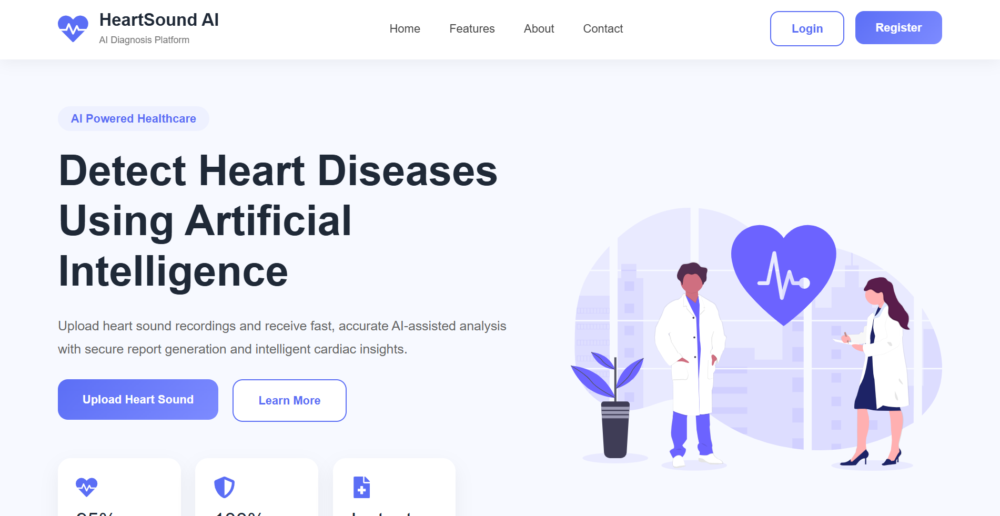
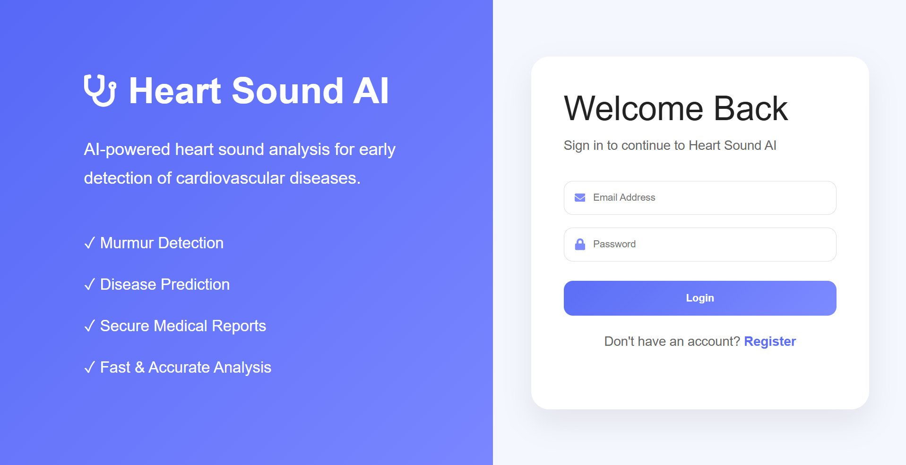
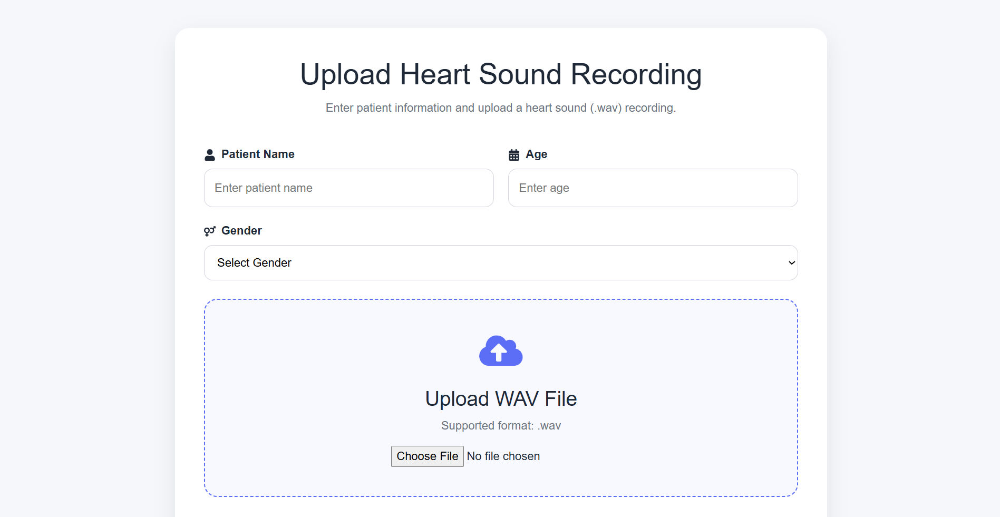
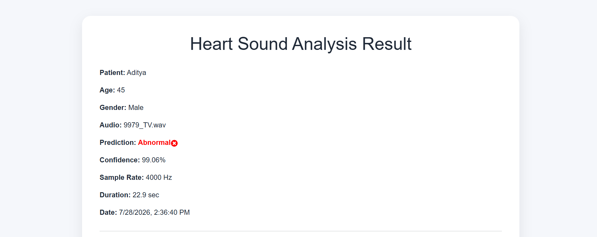
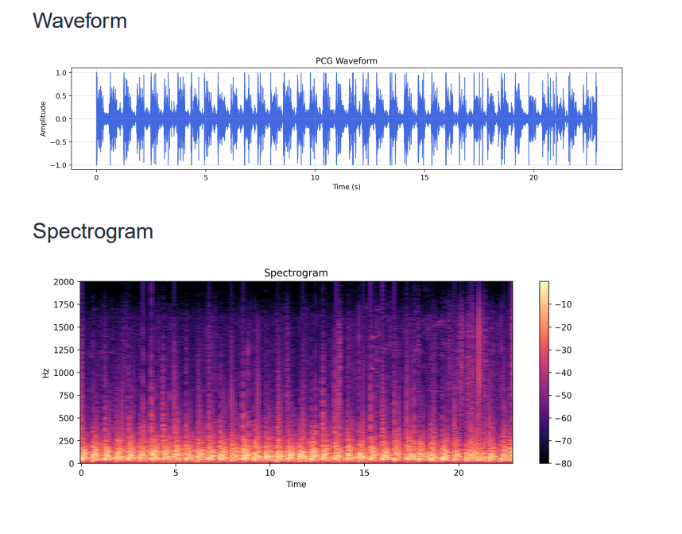
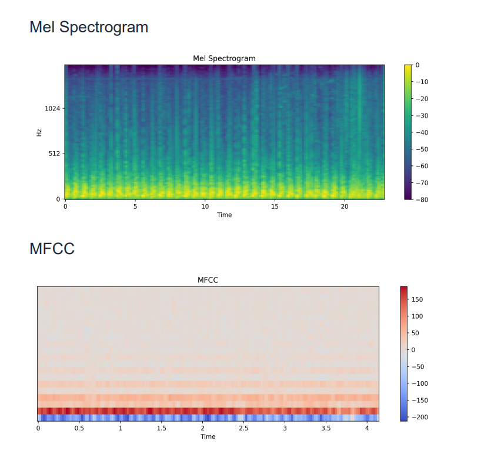

<div align="center">

# Heart Sound Disease Detection Platform

### AI-Powered Heart Sound Disease Detection using React, Node.js, Express, MongoDB, Flask, and XGBoost

A full-stack healthcare application that analyzes phonocardiogram (PCG) recordings to classify heart sounds as **Normal** or **Abnormal** using a machine learning model. The platform provides secure authentication, patient history management, signal visualizations, and downloadable PDF medical reports.

</div>

---

## Overview

The Heart Sound Disease Detection Platform is a full-stack AI-powered web application developed to assist in the analysis of heart sound recordings.

Users can securely upload heart sound recordings (.wav), obtain automated predictions using a trained XGBoost model, visualize heart sound signal representations, maintain prediction history, and generate professional PDF medical reports.

---

## Features

- Secure JWT Authentication
- User Registration and Login
- Upload Heart Sound (.wav) Recordings
- AI-Based Heart Sound Classification
- Confidence Score and Prediction Probability
- Waveform Visualization
- Spectrogram Visualization
- Mel Spectrogram Visualization
- MFCC Feature Visualization
- Patient Prediction History
- Search Previous Predictions
- Download PDF Medical Reports
- MongoDB Database Integration

---

## Tech Stack

### Frontend

- React.js
- React Router
- Axios
- React Icons
- CSS

### Backend

- Node.js
- Express.js
- MongoDB
- Mongoose
- JWT Authentication
- Multer
- PDFKit

### Machine Learning

- Python
- Flask
- XGBoost
- Librosa
- NumPy
- Matplotlib

---

## Workflow

1. User logs into the application.
2. Patient details are entered.
3. A heart sound recording (.wav) is uploaded.
4. The backend sends the recording to the Flask machine learning service.
5. The trained XGBoost model predicts whether the recording is **Normal** or **Abnormal**.
6. Waveform, Spectrogram, Mel Spectrogram, and MFCC visualizations are generated.
7. Prediction details are stored in MongoDB.
8. Users can review previous predictions through the History page.
9. A professional PDF medical report can be generated and downloaded.

---

# Application Screenshots

## Landing Page



---

## Login Page



---

## Upload Heart Sound Recording



---

## Prediction Result



---

## Signal Visualizations



---

## Additional Visualizations



---

## Project Structure

```text
Heart-Sound-Disease-Detection-Platform
│
├── backend
├── frontend
├── ml
├── assets
│   └── screenshots
├── README.md
├── package.json
├── package-lock.json
└── .gitignore
```

---

## Installation

### Clone Repository

```bash
git clone https://github.com/GarimaSharma1811/Heart-Sound-Disease-Detection-Platform.git
```

### Install Backend Dependencies

```bash
cd backend
npm install
```

### Install Frontend Dependencies

```bash
cd frontend
npm install
```

### Install Python Dependencies

```bash
cd ml
pip install -r requirements.txt
```

---

## Run the Project

### Backend

```bash
cd backend
npm run dev
```

### Frontend

```bash
cd frontend
npm run dev
```

### Machine Learning Service

```bash
cd ml
python app.py
```

---

## Future Improvements

- Multi-class heart disease classification
- Doctor dashboard
- Cloud deployment
- Email PDF reports
- Patient analytics dashboard
- Real-time heart sound streaming

---

## Author

**Garima**

B.Tech Computer Science Engineering

Thapar Institute of Engineering and Technology

GitHub: https://github.com/GarimaSharma1811
